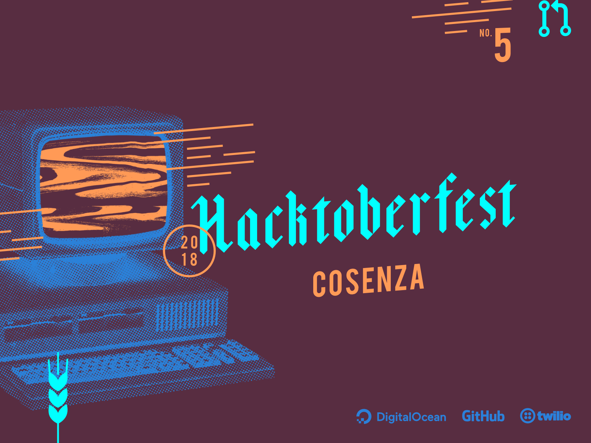

---

<!--
	footer: Hacktoberfest Cosenza 2018
-->

**Salvatore Gentile**
[_https://github.com/SalGnt_](https://github.com/SalGnt)

---

# Hacktoberfest :beer:

L'Hacktoberfest è l'evento annuale organizzato nel mese di ottobre da [**Digital Ocean**](https://www.digitalocean.com/) in collaborazione con [**GitHub**](https://github.com/) per promuovere l'idea di _software libero_.

L'obiettivo è quello di coinvolgere il maggior numero di persone all'interno della _community open source_.

---

## Come Partecipare

Per partecipare bisogna effettuare delle **Pull Request** ad un qualsiasi progetto open source presente su **GitHub**. Il progetto deve essere **pubblico** perché la Pull Request venga conteggiata.

Si può partecipare in qualsiasi momento tra l'**1** e il **31 Ottobre** previa iscrizione sul [sito ufficiale]() dell'evento.

### Premio

L'obiettivo da raggiungere durante la durata dell'evento, per poter ricevere una **T-shirt** in edizione limitata, è quello di completare **5 Pull Request**.

---

## Valori Chiave

#### Tutti sono benvenuti!

L'evento è aperto a **tutti**! Possono partecipare sia coloro i quali sono già attivi nella community open source, sia coloro i quali vogliono iniziare ad affacciarsi in questo mondo.

#### La Quantità è divertente, la Qualità è fondamentale

Partecipare all'Hacktoberfest è un'opportunità per crescere, personalmente e professionalmente.

#### Azioni a breve termine, impatto a lungo termine

La community open source è stata costruita mattone dopo mattone, ognuno si trova sulle spalle di chi lo ha preceduto. Partecipare significa iniziare un viaggio, non una gara.

---

## Standard Qualitativi

- Non sono ammessi contributi automatizzati;
- Non sono ammessi contributi non costruttivi;
- Non verranno conteggiati i contributi segnalati dal gestore del progetto come spam o non utili;
- Non verranno conteggiati i contributi che sono palesemente creati per l'evento;

---

# 
GitHub :heart: Git

---

# Git

I progetti open source disponibili su GitHub sono gestiti attraverso [Git]().

Git è un _sistema di controllo di versione distribuito_ che consente di gestire progetti ai quali partecipano più sviluppatori.

Git è open source ed è stato creato nel 2005 da **Linus Torvalds** per essere utilizzato nello sviluppo del **kernel Linux**.

---

## L'importanza di Git

Nello sviluppo è oramai quasi indispensabile l'utilizzo di un software di controllo di versione poiché esso permette di gestire il codice sorgente nella sua totalità.

Si riesce a tenere traccia di tutti i cambiamenti che sono stati effettuati durante lo sviluppo. Grazie a ciò si ha la possibilità di tornare ad uno stato precedente, qualora fosse necessario, senza difficoltà.

---

## Nozioni utili

### Repository

Una **repository** è una _cartella_ che contiene i file di progetto, la loro eventuale documentazione e la **storia di ogni singolo file**.

### Branch

Il **branch** è un meccanismo di _ramificazione_ che consente lo _sviluppo parallelo_ all'interno della stessa repository.

### Push e Pull

**Push** e **Pull** sono le operazioni che consentono, rispettivamente, di _inviare modifiche locali in remoto_ e _ricevere modifiche remote in locale_.

---

## Installazione

### Linux

Installare il pacchetto `git` dal package manager della distro in uso.

### macOS

Installare gli _strumenti per sviluppatori da riga di comando_ da terminale con il comando `xcode-select --install`.

### Windows

Scaricare ed eseguire l'[installer](http://git-scm.com/download/win) presente sul sito ufficiale.

---

## Configurazione

Prima di iniziare è bene aggiungere al file di configurazione globale di Git i dati che ci identificheranno nei singoli commit:

    git config --global user.name "Your Name"

git config --global user.email "youremail@domain.com"

**Opzionale:** è possibile indicare un editor di testo personalizzato che verrà invocato, quando necessario, da Git:

    git config --global core.editor "code --wait"

---

# Contribuire su GitHub :pencil:

Per poter contribuire ad un progetto open source è buona regola lavorare su una copia della repository che lo ospita. In questo modo si potranno effettuare tutte le modifiche desiderate senza intaccare direttamente il lavoro originale.

Il primo passo avviene attraverso l'uso del meccanismo di **Fork** messo a disposizione da GitHub.

---

## Fork

Visitando una repository, in alto a destra, è presente il pulsante **Fork**. Facendo click su di esso verrà creata una copia della repository nella propria collezione.

## Clone

Per poter lavorare sul progetto occorre disporre della repository in locale per intero. Il comando `clone` svolge esattamente questo compito.

    git clone https://github.com/your-username/project.git

---

## Push

Una volta effettuate le modifiche in locale, esse dovranno essere inviate alla repository remota su GitHub. I comandi base da utilizzare sono:

1.  Indicare i file modificati:

        git add -A

2.  Effettuare l'operazione di commit:

        git commit -m "Modifiche effettuate"

3.  Inviare le modifiche:

        git push

---

## Pull Request

Il meccanismo di **Pull Request** consente di presentare le modifiche effettuate nel progetto originale perché siano revisionate ed eventualmente inglobate.

### Creare una Pull Request

1. Sulla pagina della propria repository fare click sulla tab **Pull Requests**;
2. Fare click sul pulsante **New pull request**;
3. Fare click sul pulsante **Create pull request**;
4. Dare un **titolo** e una **descrizione** alla Pull Request e confermare con un click sul pulsante **Create pull request**.

---

# Modifiche al progetto originale

Dopo aver effettuato un'operazione di Fork è possibile che il progetto originale abbia subito modifiche. È importante poter tenere allineati Fork e progetto originale.

## Upstream

Per fare ciò è necessario aggiungere una nuova configurazione remota. Questa configurazione viene chiamata `upstream` e punta al progetto originale.

    git remote add upstream https://github.com/username/project.git

---

## Unione delle modifiche

1.  Prelevare le modifiche effettuate sul progetto originale:

        git fetch upstream

2.  Selezionare il branch `master` della copia:

        git checkout master

3.  Unire alla copia le modifiche:

        git merge upstream/master

---

# Link Utili :link:

- [**Hacktoberfest 2018**](https://hacktoberfest.digitalocean.com)
- [Hacktoberfest Checker](https://hacktoberfestchecker.herokuapp.com)

### Git Tutorials

- [An Introduction to Open Source | Digital Ocean](https://www.digitalocean.com/community/tutorial_series/an-introduction-to-open-source)
- [GitHub Help](https://help.github.com)
- [Pro Git](https://git-scm.com/book)

### GitHub Tools

- [GitHub Desktop](https://desktop.github.com)
- [GitHub Pull Requests for VS Code](https://marketplace.visualstudio.com/items?itemName=GitHub.vscode-pull-request-github)

---

# 
Let's Code! :computer:

