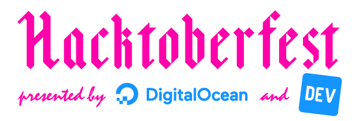

# Hacktoberfest Cosenza 2019

Presentation used for my talk at [Hacktoberfest Cosenza 2019](https://www.meetup.com/it-IT/Google-Developer-Group-Cosenza/events/265320911) event. The slides were made using the _Markdown Presentation Writer_ [Marp](https://marp.app/).

## Getting Started

You can contribute to any project on **GitHub**. [Here](https://github.com/search?q=label:hacktoberfest+state:open+type:issue) are a few looking for some help.

### Beginners

The following resources share repositories that curate tasks for beginners:

- [Up For Grabs](https://up-for-grabs.net)
- [Issuehub.io](http://issuehub.io)
- [First Timers Only](https://www.firsttimersonly.com)
- [Your First PR](http://yourfirstpr.github.io)
- [Awesome for Beginners](https://github.com/mungell/awesome-for-beginners)

### Advanced

Once you start feeling more comfortable, you can continue to find more open source projects that can use your help through the following programs:

- [Pull Request Roulette](http://www.pullrequestroulette.com)
- [CodeTriage](https://www.codetriage.com)
- [24 Pull Requests](https://24pullrequests.com) (Like Hacktoberfest, except in December)

### Extras

- [Codetribute](https://codetribute.mozilla.org) - Find your first code contribution with Mozilla
- [Microsoft Open Source](https://opensource.microsoft.com) - Open source releases from Microsoft
